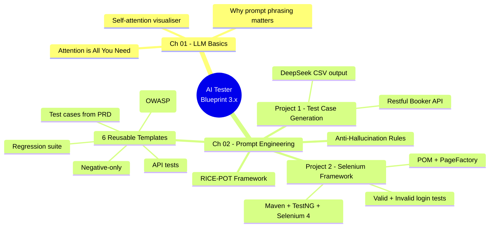
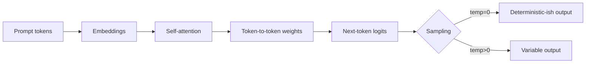
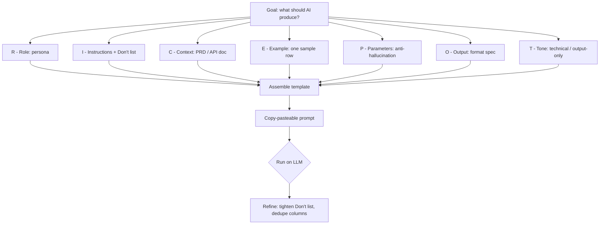

# AI Tester Blueprint 3.x

A practical, project-driven curriculum for QA engineers learning to use LLMs as a real testing tool — not a toy.
Each chapter pairs concept material with a hands-on project, a prompt template, and runnable code where applicable.

- **Software Tester & SME :** **Prathamesh Dhakane** — Senior QA Lead & Pega PRPC SME
- **Experience:** 8 years of enterprise software testing across Pega, SaaS, and data archiving platforms (Infogain, Capgemini, AvenData)
- **Certifications:** ISTQB Certified Tester | Selenium WebDriver with Java | Playwright Automation (In Progress – Q2 2026) | Generative AI for Testers

---

### About the Tester (Prathamesh Dhakane)

Senior QA Lead and Subject Matter Expert with **8 years of enterprise software testing experience** across Pega, SaaS, and data archiving platforms. Currently working at **Infogain** (Mumbai, India) as Senior Consultant — Testing, promoted to SME within 1 year. Previously delivered QA for **CISCO's U.S. Pega platform** across 10+ Agile sprints at Capgemini with zero critical production defects at launch. Specializes in defining automation scope, building execution blueprints, failure-log triage, and guiding automation teams on coverage priorities.

**Key Achievements:**
- **30%** Regression Cycle Reduction across 3+ concurrent projects
- **500+** Test Cases authored for CISCO Platform with 100% requirement-to-test traceability
- **0** Production Escapes over 2+ years
- **40%** Onboarding Time Reduction — standardized QA documentation suite adopted org-wide
- **10+** QA Associates Mentored — slashed invalid bug reports from 6–8 to <2/sprint
- **200+** Defects Managed End-to-End
- **25%** Debug Time Saved via Pega Tracer & Clipboard
- **60+** Automation Scenarios Scoped & Blueprinted

**Contact:**
- 📧 prathameshdhakane89@gmail.com
- 📱 +91 99872 68398
- 🔗 [LinkedIn](https://linkedin.com/in/prathamesh-dhakane-140763131)
- 📍 Mumbai, India

**Education:**
- LLB — Bachelor of Laws, New Law College, Mumbai (2023)
- B.Sc. — Information Technology, D.G. Ruparel College, Mumbai (2016)

**Languages:** English, Hindi, Marathi

**Awards & Recognition:**
- 🏆 Employee of the Month — Feb 2025 (Infogain)
- 🏆 Spot Award — Dec 2023 (Infogain)

---

## Curriculum Map



---

## Repository Layout

```
.
├── chapter_01_LLM_Basics/         How transformers and attention work
│   ├── attention_interactive.html
│   ├── attention_is_all_you_need.html
│   └── Notes.md
│
└── chapter_02_Prompt_Eng/         Prompt engineering for QA work
    ├── Anti_Hallucinations_Rules.md
    ├── Project1_TC_Gen/           Test case generation from a PRD/API doc
    │   ├── RICE-POT-TestCase-Prompt.md
    │   ├── RICE_POT_FRAMEWORK/
    │   ├── Restful-booker.pdf
    │   ├── Restful_Booker_API_Test_Cases.md
    │   └── output/
    ├── Project2_Selenium_Framework/   POM-based Selenium framework built from a prompt
    │   ├── Problem.md
    │   ├── SKILL.md                   RICE-POT prompt-builder skill
    │   ├── blank-template-rice-pot.md
    │   └── AdvanceSeleniumFramework/  Maven + TestNG + Selenium 4
    └── templates/                 Reusable prompt templates (RTCFR / RICE-POT)
        ├── 01_TestCaseGeneration_Prompt.md
        ├── 02_TestCases_from_prd
        ├── 03_API_Test_Generation.md
        ├── 04_Negative_TC_Only.md
        ├── 05_Secuirty_Test.md
        └── 06_Regression_Suite.md
```

---

## Chapter 01 — LLM Basics

Foundational material on how Large Language Models read text and decide what to output. The key idea: a model is not a database lookup — it weighs every token against every other token (attention) and predicts the next one.

**What's here:**
- `attention_is_all_you_need.html` — interactive walkthrough of the original Transformer paper concepts.
- `attention_interactive.html` — visualises self-attention so you can see why prompt phrasing changes outputs.
- `Notes.md` — short recap notes.

**Why a QA engineer should care:** the model's behaviour is deterministic-ish on a per-token level, but every word you add to a prompt shifts the attention weights. That is why structured prompt frameworks (next chapter) outperform free-form questions.

**Q&A — why this matters for testing:**
- **Q: Why does the same prompt give different test cases each run?** A: Sampling temperature plus floating-point non-determinism in attention. Pin `temperature=0` and set explicit constraints to flatten variance.
- **Q: Why does adding "be thorough" rarely help?** A: Vague tokens add weight without direction. Replace with measurable constraints — "cover boundary, negative, and security cases" steers attention to specific output shape.
- **Q: Do I need to read the original Transformer paper?** A: No — but understanding that the model weighs every token against every other token explains why irrelevant words in your prompt pollute the answer.

**Mental model — how one prompt token influences the output:**



**Quick demo — try it locally:**

```bash
# clone, then just open the HTML files in a browser - no build, no install
open chapter_01_LLM_Basics/attention_interactive.html
open chapter_01_LLM_Basics/attention_is_all_you_need.html
```

Hover over tokens in `attention_interactive.html` to see the live attention matrix. Edit the input sentence to see weights shift in real time — that's the same mechanism that makes your prompt wording matter.

---

## Chapter 02 — Prompt Engineering for QA

This chapter turns prompt engineering into a repeatable QA skill. Three pillars:

1. **Anti-hallucination rules** — guardrails so the model only uses provided input.
2. **RICE-POT framework** — a structured prompt template (Role, Instructions, Context, Example, Parameters, Output, Tone).
3. **Two projects + six templates** — applied on real artifacts (a PRD-style API doc and a Selenium framework build).

**Q&A — RICE-POT vs free-form prompting:**
- **Q: I already get OK results from "write test cases for this PRD." Why bother with a framework?** A: "OK" is the ceiling. RICE-POT forces you to declare the persona, format, and constraints, which is what turns a 60% useful answer into a 95% useful one — every time, not just on lucky runs.
- **Q: Isn't this just over-engineering a chat message?** A: For one-offs, yes. For repeatable QA tasks (regression suites, security checklists, daily test-case generation), the template pays for itself within three uses.
- **Q: Which letter is most often skipped — and what breaks?** A: `P` (Parameters). Without the anti-hallucination block, the model invents fields, IDs, and error codes that don't exist in your PRD. Output looks plausible but ships bugs.

**RICE-POT prompt flow — from goal to copy-pasteable prompt:**



### Anti-Hallucination Rules (`Anti_Hallucinations_Rules.md`)

A drop-in `ROLE` block you prepend to any QA prompt. Forces the model to:
- Use only the inputs you provide (PRD, screenshots, API docs).
- Refuse to assume "typical" system behaviour.
- Output exactly `"Insufficient information to determine."` when an input is missing.
- Label inferred details as `"Inference (low confidence)"`.
- Produce a Verified Facts / Missing Info / Output / Self-Validation block.

Use this on every factual-generation prompt in this repo.

### Project 1 — Test Case Generation with RICE-POT

Goal: turn an API PDF (`Restful-booker.pdf`) into a CSV of enterprise-grade test cases.

- `RICE-POT-TestCase-Prompt.md` — the worked prompt. Targets `app.vwo.com` as the example product, but the structure transfers to any PRD/API doc.
- `RICE_POT_FRAMEWORK/RICE_POT.md` — explanation of each letter of the framework.
- `Restful-booker.pdf` + `Restful_Booker_API_Test_Cases.md` — input PDF and the generated test-case set.
- `output/deepseek_csv_20260524_0d9b7c.csv` — actual model output produced from the prompt.

**Q&A — Project 1 design choices:**
- **Q: Why a PDF input and not just pasted text?** A: PDFs mirror how QA actually receives PRDs and API specs. Forcing the model to extract from the document tests whether the prompt's anti-hallucination block holds under realistic input noise.
- **Q: Why CSV output instead of Markdown?** A: CSV imports cleanly into Jira, TestRail, qTest, and Zephyr. The model is told the exact column order so the file drops straight into a test-management tool.
- **Q: How do I trust the output?** A: Cross-check the `Traceability` column — every test case row must cite a section of the source PDF. Rows without traceability fail review.

**Sample output row (from `deepseek_csv_20260524_0d9b7c.csv`):**

```csv
TC_ID,Title,Preconditions,Steps,Test Data,Expected Result,Type,Priority,Traceability
TC_API_007,Create booking with valid payload,"Auth token obtained","POST /booking with required fields","firstname=Jim, lastname=Brown, totalprice=111, depositpaid=true","HTTP 200 + bookingid + booking object echoed back",Positive,High,"Restful-booker.pdf §Booking → CreateBooking"
```

**How to exercise it:**
1. Open `RICE-POT-TestCase-Prompt.md` in any AI tool (ChatGPT, Claude, Gemini, DeepSeek).
2. Attach `Restful-booker.pdf` (or your own PRD).
3. Confirm the output is CSV only, columns match the spec, and every test case traces back to the PDF.

### Project 2 — Selenium Framework from a Prompt

Goal: prove RICE-POT can build production code, not just test cases.

- `Problem.md` — the brief: "generate a Selenium framework from scratch with two page objects, production ready."
- `SKILL.md` — the RICE-POT prompt-builder skill definition. Tells the AI how to interview you, assemble the prompt, and deliver it copy-pasteable.
- `blank-template-rice-pot.md` — fill-in template with the recommended anti-hallucination Parameters block.
- `AdvanceSeleniumFramework/` — the actual output the framework generates:
  - Maven project, Java 11, Selenium 4.25, TestNG 7.10.
  - `LoginPage.java` — PageFactory POM with explicit waits, fluent API, no Thread.sleep.
  - `BaseTest.java` — driver lifecycle.
  - `ConfigReader.java` — `config.properties` loader.
  - `ValidLoginTest.java` / `InvalidLoginTest.java` — positive + negative TestNG cases.
  - `testng.xml` / `testng-smoke.xml` — full and smoke suites.

**Q&A — Project 2 design choices:**
- **Q: Why XPath only?** A: The prompt locked it to one locator strategy on purpose — consistency makes generated code reviewable. In production you'd mix CSS + XPath, but the discipline of "one strategy" is what the prompt enforces.
- **Q: Where do real credentials go?** A: `src/main/resources/config.properties`. Placeholders `REPLACE_WITH_...` fail fast in `@BeforeTest` so a forgotten config never silently passes a test.
- **Q: Why headless Chrome by default?** A: macOS 26.1 + Chrome 148 dropped windowed sessions mid-test in this repo. Headless avoids the focus/sandbox issue and is what CI uses anyway.

**Framework architecture — what the prompt generated:**

```mermaid
flowchart TD
    CFG[config.properties] --> CR[ConfigReader]
    CR --> BT[BaseTest]
    BT -->|@BeforeMethod| D[ChromeDriver headless]
    BT -->|@AfterMethod| Q[driver.quit]
    LP[LoginPage - POM + PageFactory] --> XP["@FindBy xpath only"]
    VT[ValidLoginTest] --> LP
    IT[InvalidLoginTest + @DataProvider] --> LP
    VT -.extends.-> BT
    IT -.extends.-> BT
    SUITE[testng.xml] --> VT
    SUITE --> IT
    SMOKE[testng-smoke.xml] --> IT
```

**LoginPage snippet (XPath + explicit waits, no Thread.sleep):**

```java
public class LoginPage {
    @FindBy(xpath = "//input[@id='username']") private WebElement usernameField;
    @FindBy(xpath = "//input[@id='password']") private WebElement passwordField;
    @FindBy(xpath = "//input[@id='Login']")    private WebElement loginButton;
    @FindBy(xpath = "//div[@id='error']")      private WebElement errorMessage;

    public LoginPage(WebDriver driver) {
        this.wait = new WebDriverWait(driver,
            Duration.ofSeconds(ConfigReader.getInt("timeout.explicit")));
        PageFactory.initElements(driver, this);
    }

    public void loginAs(String user, String pass) {
        wait.until(ExpectedConditions.visibilityOf(usernameField)).sendKeys(user);
        passwordField.sendKeys(pass);
        wait.until(ExpectedConditions.elementToBeClickable(loginButton)).click();
    }
}
```

**Run it:**
```bash
cd chapter_02_Prompt_Eng/Project2_Selenium_Framework/AdvanceSeleniumFramework
mvn -q clean test-compile
mvn test                       # full suite
mvn test -DsuiteXmlFile=testng-smoke.xml   # smoke only
```

### Templates — RTCFR + RICE-POT (`templates/`)

Six copy-paste prompt templates for the most common QA tasks. Each follows the **RTCFR** shape — Role, Task, Constraints, Format, Requirements — which is the lightweight cousin of RICE-POT.

| # | File | Purpose |
|---|------|---------|
| 01 | `01_TestCaseGeneration_Prompt.md` | Basic test-case generation from free-form requirements. |
| 02 | `02_TestCases_from_prd` | Comprehensive PRD → test cases (functional, negative, boundary, edge). |
| 03 | `03_API_Test_Generation.md` | API endpoint test cases from API docs. |
| 04 | `04_Negative_TC_Only.md` | Negative-only suite — invalid inputs, auth violations, malformed data. |
| 05 | `05_Secuirty_Test.md` | OWASP-top-10-aligned security test cases. |
| 06 | `06_Regression_Suite.md` | Regression suite for a module with execution-time estimates. |

**Use any template:**
1. Open the file and copy the fenced block.
2. Replace `[FEATURE]` / `[PASTE REQUIREMENTS]` / `[PASTE PRD]` etc. with your input.
3. Paste into your AI tool. Keep the `CONSTRAINTS` block intact — that's what stops hallucination.

---

## How to Use This Repo

You can read it linearly (chapter 01 → 02) or jump straight to a project:

- **"I want better test cases now."** → `chapter_02_Prompt_Eng/templates/01_TestCaseGeneration_Prompt.md` or `02_TestCases_from_prd`.
- **"I want to write tests from a PDF/API doc."** → `chapter_02_Prompt_Eng/Project1_TC_Gen/`.
- **"I want to scaffold a Selenium project."** → `chapter_02_Prompt_Eng/Project2_Selenium_Framework/SKILL.md`, then run the Maven project under `AdvanceSeleniumFramework/`.
- **"I want my model to stop making things up."** → `chapter_02_Prompt_Eng/Anti_Hallucinations_Rules.md`.

## Requirements

- Any modern LLM (Claude / GPT / Gemini / DeepSeek). No specific provider required.
- For Project 2 only: **JDK 11+** and **Maven 3.9+** to compile and run the Selenium framework.

## Previous Chapters

`a2eb280` — chapter 01 LLM basics with interactive attention visualisations.
`dfe2653` — chapter 02 prompt engineering with RICE-POT framework + Selenium project.

---

Made by [Prathamesh Dhakane](https://linkedin.com/in/prathamesh-dhakane-140763131) for The Testing Academy.
